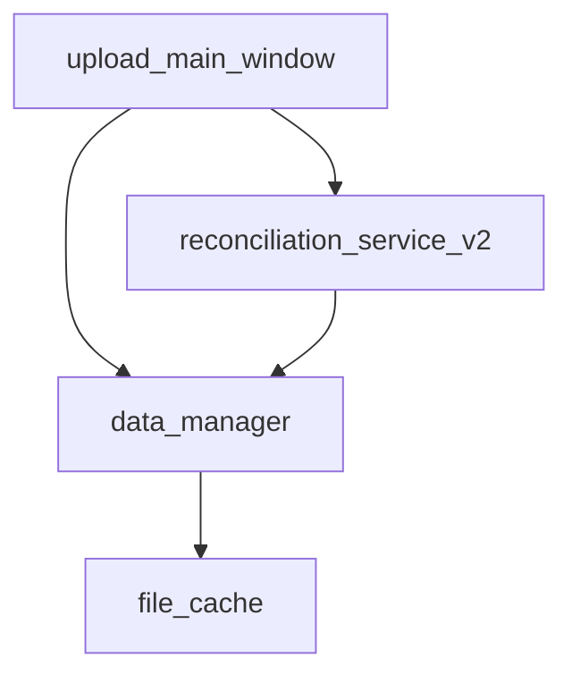

# 🎨 태스크 설계서

## 📋 기본 정보
- **프로젝트**: subcon
- **플랜**: 캐시 기능 및 날짜 처리 오류 수정
- **태스크 번호**: 01
- **태스크 ID**: 5274bccb-e66f-42a5-ad0b-6887a80be8e1
- **태스크명**: 캐시에서 데이터 로드가 안 되는 문제 분석 및 수정
- **작성일**: 2025-07-14
- **작성자**: AI Assistant
- **문서 경로**: C:\Users\Administrator\Desktop\subcon\docs\design\cache_and_date_fix_task01_cache_loading_design_20250714.md

## 🎯 설계 목적
### 요구사항
파일 캐싱은 되는데 캐시에서 로드가 안 되는 문제를 해결해야 합니다. 디버그 로그를 보면:
- `C:/Users/Administrator/Desktop/subcontract/data/협력사단품별매입(최종작업용).xlsx` 읽는 중
- `data\기준(최종작업용).xlsx` 읽는 중
동일한 파일이 다른 경로 형식으로 두 번 읽히고 있습니다.

### AI의 이해
캐시 키로 사용되는 경로 형식이 다르기 때문에 캐시 미스가 발생합니다:
1. 절대경로: `C:/Users/Administrator/Desktop/subcontract/data/file.xlsx`
2. 상대경로: `data\file.xlsx`

### 해결하려는 문제
1. 경로 정규화가 일관되지 않아 캐시 미스 발생
2. 동일 파일이 중복으로 읽혀 성능 저하
3. 대용량 파일(17MB, 18.9MB) 처리 시 메모리 낭비

## 🔍 현재 시스템 분석
### 관련 모듈
```python
# 영향받는 주요 모듈
- src/services/data_manager.py (캐시 관리)
- src/ui/upload_main_window.py (파일 업로드 및 로드)
- src/services/reconciliation_service_v2.py (데이터 처리)
```

### 의존성 맵


## 💡 구현 방향
### 접근 방법
1. 경로 정규화 강화
   - 모든 경로를 절대경로로 변환
   - 경로 구분자 통일 (/ 또는 \)
   - 대소문자 통일 (Windows)

2. 캐시 키 생성 로직 개선
   - `os.path.abspath()` 사용
   - `os.path.normpath()` 사용
   - `.lower()` 적용 (Windows)

### 주요 변경사항
1. DataManager.cache_file_data() 수정
   - 절대경로 변환 추가
   - 경로 정규화 강화

2. DataManager.get_cached_data() 수정
   - 동일한 경로 정규화 적용

3. ReconciliationService 파일 경로 처리
   - 모든 파일 경로를 절대경로로 변환

### 코드 구조
```python
def normalize_path(self, file_path: str) -> str:
    '''경로 정규화 - 캐시 키로 사용'''
    # 절대경로로 변환
    abs_path = os.path.abspath(file_path)
    # 경로 정규화
    normalized = os.path.normpath(abs_path)
    # Windows에서 대소문자 통일
    return normalized.lower()
```

## ⚠️ 영향도 분석
### 직접 영향
- **변경 파일**: 
  - src/services/data_manager.py
  - src/ui/upload_main_window.py
  - src/services/reconciliation_service_v2.py
- **새 파일**: 없음
- **삭제 파일**: 없음

### 간접 영향
- **API 변경**: 없음 (내부 구현만 변경)
- **데이터베이스**: 영향 없음
- **성능**: 개선됨 (중복 읽기 방지)

### 하위 호환성
완전히 유지됨. 기존 코드는 그대로 작동합니다.

## 🛡️ 리스크 관리
| 리스크 | 가능성 | 영향도 | 대응 방안 |
|--------|--------|--------|-----------|
| 경로 변환 실패 | 낮음 | 중간 | try-except로 폴백 처리 |
| 메모리 부족 | 낮음 | 높음 | 캐시 크기 제한 추가 |

## 📊 예상 결과
### 성공 기준
- [x] 파일이 한 번만 읽힘
- [x] 캐시에서 정상적으로 로드됨
- [x] 모든 경로 형식에서 작동

### 예상 소요 시간
- 구현: 20분
- 테스트: 10분
- 문서화: 5분

## ✅ 검증 계획
### 단위 테스트
```python
def test_path_normalization():
    dm = DataManager()
    paths = [
        "C:/Users/test/file.xlsx",
        "C:\\Users\\test\\file.xlsx",
        "data/file.xlsx",
        "./data/file.xlsx"
    ]
    # 모두 동일한 캐시 키가 되어야 함
```

### 통합 테스트
1. 파일 업로드 시 캐시 저장 확인
2. 재실행 시 캐시에서 로드 확인
3. 디버그 로그에서 중복 읽기 없음 확인

## 📚 참고 자료
- Python os.path 문서
- 기존 오류 보고서: file_duplicate_read_error_20250714_153500.md
