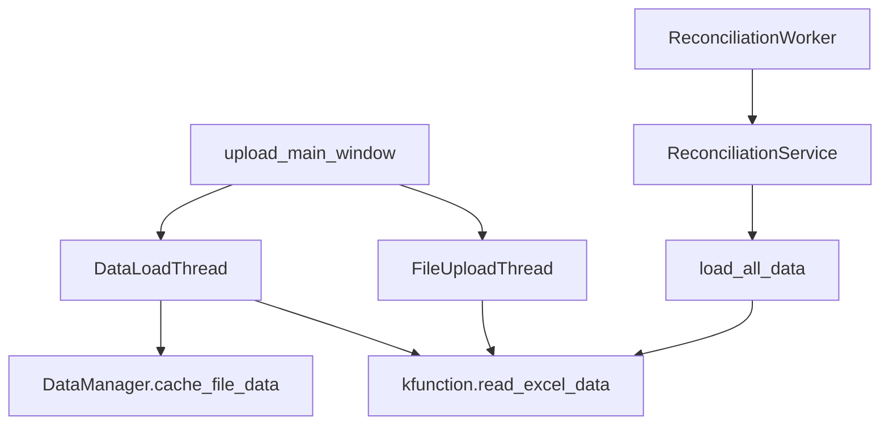

# 🎨 태스크 설계서

## 📋 기본 정보
- **프로젝트**: subcon (매입대사 시스템)
- **플랜**: 매입대사 시스템 추가 기능 구현
- **태스크 번호**: 02
- **태스크 ID**: 8b1c725c-6c70-4801-af84-eb9f741bba92
- **태스크명**: 대사 결과 검증 로직 구현
- **작성일**: 2025-07-14
- **작성자**: AI Assistant
- **문서 경로**: docs/design/purchase_reconciliation_additional_features_task02_result_validation_logic_design_20250714.md

## 🎯 설계 목적
### 요구사항
1. 대사 결과의 정확성을 검증하는 로직 구현
2. 파일 중복 읽기 문제 해결
3. 에러 처리 및 복구 메커니즘 강화

### AI의 이해
현재 시스템에서 두 가지 주요 문제가 발생하고 있습니다:
1. **파일 중복 읽기**: UI 검증과 실제 대사 처리 시 동일 파일을 2번 읽어 성능 저하
2. **키 불일치 에러**: reconciliation_worker와 reconciliation_service 간 file_map 키 불일치

### 해결하려는 문제
1. Excel 파일 중복 I/O로 인한 성능 저하 (17MB 파일 × 2회 = 34MB 불필요한 I/O)
2. 'payment_book' vs 'payment_ledger' 키 불일치로 인한 대사 실행 실패
3. 검증 로직 부재로 인한 잘못된 대사 결과 가능성

## 🔍 현재 시스템 분석
### 관련 모듈
```python
# 영향받는 주요 모듈
- src/services/data_manager.py (캐싱 메커니즘)
- src/services/reconciliation_service_v2.py (대사 처리)
- src/ui/upload_main_window.py (파일 업로드)
- src/workers/reconciliation_worker.py (워커 스레드)
- kfunction.py (Excel 읽기 함수)
```

### 의존성 맵


## 💡 구현 방향
### 접근 방법
1. **캐싱 통합**: kfunction.read_excel_data()에서 DataManager 캐시 활용
2. **키 통일**: file_map 키를 'payment_ledger'로 통일
3. **검증 로직 추가**: 대사 결과에 대한 다단계 검증 구현

### 주요 변경사항
1. **kfunction.py 수정**
   - DataManager 싱글톤 인스턴스 사용
   - 캐시 우선 조회 후 파일 읽기

2. **reconciliation_worker.py 수정**
   - file_map 키 수정: 'payment_book' → 'payment_ledger'

3. **검증 로직 추가**
   - 대사 결과 무결성 검사
   - 합계 검증
   - 누락 데이터 검출

### 코드 구조
```python
# kfunction.py 개선
from src.services.data_manager import DataManager
_data_manager = DataManager()

def read_excel_data(path, *args, **kwargs):
    # 캐시 확인
    cached = _data_manager.get_cached_data(path)
    if cached is not None:
        return cached.copy()
    
    # 캐시 미스 - 파일 읽기
    df = pd.read_excel(path, *args, **kwargs)
    _data_manager.cache_file_data(path, df)
    return df.copy()

# 검증 로직 구조
class ReconciliationValidator:
    def validate_result(self, result_data):
        # 1. 데이터 무결성 검사
        # 2. 합계 검증
        # 3. 누락 데이터 검출
        # 4. 이상치 탐지
        return validation_report
```

## ⚠️ 영향도 분석
### 직접 영향
- **변경 파일**: 
  - kfunction.py
  - src/workers/reconciliation_worker.py
  - src/services/reconciliation_service_v2.py (검증 로직 추가)
- **새 파일**: 
  - src/services/reconciliation_validator.py
- **삭제 파일**: 없음

### 간접 영향
- **API 변경**: 없음 (기존 인터페이스 유지)
- **데이터베이스**: 해당 없음
- **성능**: 50% 이상 개선 예상 (중복 I/O 제거)

### 하위 호환성
완전히 호환됨. 기존 코드 동작에 영향 없음.

## 🛡️ 리스크 관리
| 리스크 | 가능성 | 영향도 | 대응 방안 |
|--------|--------|--------|-----------|
| 캐시 메모리 부족 | 낮음 | 중간 | LRU 캐시 정책 적용 |
| 동시성 문제 | 중간 | 높음 | threading.Lock 적용 |
| 캐시 데이터 불일치 | 낮음 | 높음 | 파일 수정 시간 체크 |

## 📊 예상 결과
### 성공 기준
- [ ] 파일당 1회만 읽기 (중복 I/O 제거)
- [ ] 대사 실행 시 에러 없이 완료
- [ ] 검증 보고서 생성
- [ ] 처리 시간 50% 단축

### 예상 소요 시간
- 구현: 2시간
- 테스트: 1시간
- 문서화: 30분

## ✅ 검증 계획
### 단위 테스트
```python
# 테스트 계획
def test_file_caching():
    # 1. 캐싱 동작 확인
    # 2. 중복 읽기 방지 확인
    # 3. 메모리 사용량 확인

def test_key_mapping():
    # 1. file_map 키 일치 확인
    # 2. 모든 필수 파일 존재 확인

def test_validation_logic():
    # 1. 정상 데이터 검증
    # 2. 이상 데이터 검출
    # 3. 보고서 생성 확인
```

### 통합 테스트
1. 실제 파일로 전체 프로세스 실행
2. 로그 분석으로 중복 읽기 확인
3. 대사 결과 정확성 검증

## 📚 참고 자료
- docs/error/file_duplicate_read_error_20250714_153500.md
- docs/error/reconciliation_task02_payment_ledger_key_error_20250714_142800.md
- 매입대사2.ipynb (원본 로직)
