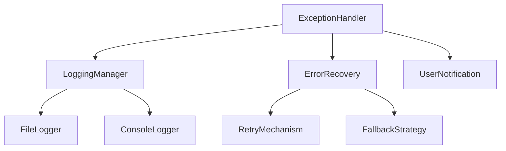

# 🎨 태스크 설계서

## 📋 기본 정보
- **프로젝트**: subcon (매입대사 시스템)
- **플랜**: 매입대사 시스템 추가 기능 구현
- **태스크 번호**: 03
- **태스크 ID**: 46c96d1a-3dd0-4326-9092-c7d270b9c3f1
- **태스크명**: 예외 처리 강화
- **작성일**: 2025-07-14
- **작성자**: AI Assistant
- **문서 경로**: docs/design/purchase_reconciliation_additional_features_task03_exception_handling_design_20250714.md

## 🎯 설계 목적
### 요구사항
1. 시스템 전반의 예외 처리 메커니즘 강화
2. 사용자 친화적인 오류 메시지 제공
3. 오류 발생 시 시스템 안정성 유지
4. 오류 로깅 및 추적 시스템 구축

### AI의 이해
현재 시스템에서 여러 종류의 예외가 발생하고 있으며, 이로 인해 사용자 경험이 저하되고 있습니다:
1. **임포트 오류**: 상대 임포트 사용으로 인한 "beyond top-level package" 오류
2. **Timezone 오류**: pandas Timestamp 처리 시 발생하는 AttributeError
3. **파일 경로 오류**: 잘못된 프로젝트 경로 참조
4. **UI 블로킹**: 동기적 파일 처리로 인한 UI 멈춤

### 해결하려는 문제
1. 예외 발생 시 시스템 중단 방지
2. 명확한 오류 메시지와 해결 방안 제시
3. 오류 자동 복구 메커니즘 구현
4. 오류 추적 및 분석 시스템 구축

## 🔍 현재 시스템 분석
### 관련 모듈
```python
# 영향받는 주요 모듈
- src/ui/upload_main_window.py (임포트 오류)
- src/services/reconciliation_service_v2.py (timezone 오류)
- src/ui/main_window_v2.py (UI 블로킹)
- src/ui/workers/reconciliation_worker.py (예외 처리)
- kfunction.py (파일 읽기 오류)
```

### 의존성 맵


## 💡 구현 방향
### 접근 방법
1. **중앙집중식 예외 처리**: ExceptionHandler 클래스 구현
2. **계층적 예외 처리**: 각 레벨에서 적절한 처리
3. **자동 복구 메커니즘**: 재시도 및 대체 방안
4. **사용자 알림 시스템**: 명확한 오류 메시지

### 주요 변경사항
1. **임포트 오류 수정 (완료)**
   - 모든 상대 임포트를 절대 임포트로 변경
   - 실행 스크립트 개선

2. **Timezone 예외 처리**
   - pandas Timestamp 안전한 변환
   - timezone aware/naive 자동 감지

3. **예외 처리 클래스 추가**
   - ExceptionHandler: 중앙 예외 관리
   - ErrorLogger: 오류 로깅
   - RecoveryManager: 자동 복구

### 코드 구조
```python
# exception_handler.py
class ExceptionHandler:
    def __init__(self):
        self.logger = ErrorLogger()
        self.recovery = RecoveryManager()
    
    def handle_exception(self, exc_type, exc_value, exc_traceback):
        # 1. 로깅
        self.logger.log_error(exc_type, exc_value, exc_traceback)
        
        # 2. 분류
        error_category = self.classify_error(exc_type)
        
        # 3. 복구 시도
        if self.recovery.can_recover(error_category):
            return self.recovery.attempt_recovery(exc_type, exc_value)
        
        # 4. 사용자 알림
        self.notify_user(error_category, exc_value)

# 데코레이터 패턴
def safe_execute(fallback=None):
    def decorator(func):
        def wrapper(*args, **kwargs):
            try:
                return func(*args, **kwargs)
            except Exception as e:
                handler = ExceptionHandler()
                result = handler.handle_exception(type(e), e, e.__traceback__)
                if result is not None:
                    return result
                elif fallback is not None:
                    return fallback
                raise
        return wrapper
    return decorator
```

## ⚠️ 영향도 분석
### 직접 영향
- **변경 파일**: 
  - src/utils/exception_handler.py (신규)
  - src/utils/error_logger.py (신규)
  - src/utils/recovery_manager.py (신규)
  - 모든 서비스 및 UI 파일 (데코레이터 적용)
- **새 파일**: 
  - src/utils/exception_handler.py
  - src/utils/error_logger.py
  - src/utils/recovery_manager.py
  - logs/error_log.json
- **삭제 파일**: 없음

### 간접 영향
- **API 변경**: 없음 (데코레이터 패턴으로 기존 코드 유지)
- **데이터베이스**: 해당 없음
- **성능**: 약간의 오버헤드 (<1%)

### 하위 호환성
완전히 호환됨. 기존 코드는 그대로 유지하면서 데코레이터로 보강.

## 🛡️ 리스크 관리
| 리스크 | 가능성 | 영향도 | 대응 방안 |
|--------|--------|--------|-----------|
| 과도한 예외 처리 | 중간 | 낮음 | 성능 모니터링 |
| 로그 파일 크기 증가 | 높음 | 중간 | 로그 순환 정책 적용 |
| 예외 마스킹 | 낮음 | 높음 | 개발 모드 플래그 추가 |

## 📊 예상 결과
### 성공 기준
- [ ] 모든 예외가 적절히 처리됨
- [ ] 오류 메시지가 사용자 친화적임
- [ ] 시스템이 예외 발생 후에도 계속 작동
- [ ] 오류 로그가 체계적으로 기록됨

### 예상 소요 시간
- 구현: 3시간
- 테스트: 2시간
- 문서화: 1시간

## ✅ 검증 계획
### 단위 테스트
```python
# 테스트 계획
def test_import_errors():
    # 1. 임포트 오류 시뮬레이션
    # 2. 예외 처리 확인
    # 3. 시스템 계속 작동 확인

def test_timezone_errors():
    # 1. 다양한 timezone 시나리오
    # 2. 안전한 변환 확인
    # 3. 데이터 무결성 확인

def test_recovery_mechanism():
    # 1. 재시도 로직 테스트
    # 2. 대체 방안 테스트
    # 3. 최종 실패 처리 테스트
```

### 통합 테스트
1. 실제 오류 시나리오 재현
2. 전체 시스템 안정성 테스트
3. 사용자 경험 테스트

## 📚 참고 자료
- docs/error/subcon_timezone_error_20250714_151855.md
- docs/error/ui_blocking_analysis_20250714_143700.md
- Python Exception Handling Best Practices
- PyQt6 Error Handling Guidelines
