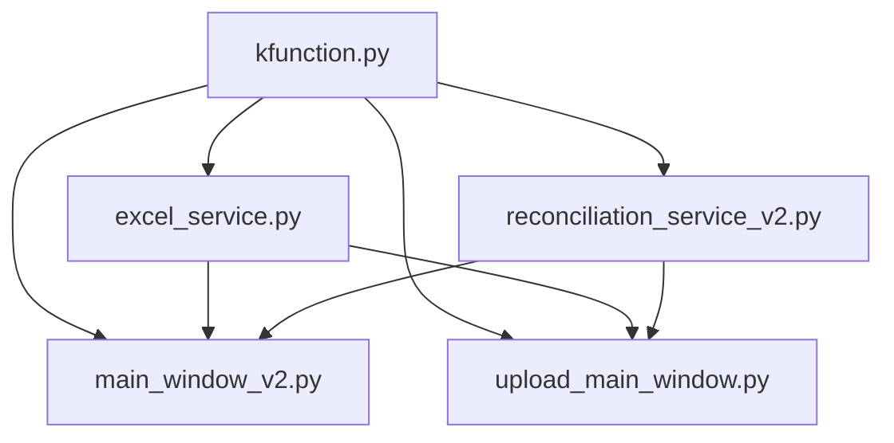

# 🎨 태스크 설계서

## 📋 기본 정보
- **프로젝트**: subcon
- **플랜**: 매입대사 시스템 UI 제품화
- **태스크 번호**: 02
- **태스크 ID**: 89bba2fc-060f-411a-a54f-1f207c7e2ef3
- **태스크명**: UI/UX 설계 및 레이아웃 개선
- **작성일**: 2025-07-14
- **작성자**: AI Assistant
- **문서 경로**: C:\Users\Administrator\Desktop\subcon\docs\design\purchase_reconciliation_ui_task02_ui_ux_design_design_20250714.md

## 🎯 설계 목적
### 요구사항
- kfunction.py의 read_excel_data 함수를 모든 UI에서 사용하도록 통합
- Excel 파일 읽기 오류 해결
- 파일 업로드 UI의 안정성 개선

### AI의 이해
기존에 pandas의 read_excel을 직접 사용하던 코드를 kfunction의 read_excel_data로 교체하여:
1. pywin32 COM 객체를 통한 정확한 Excel 데이터 읽기
2. 메모리 효율적인 처리
3. 다양한 Excel 형식 지원
4. 노트북 코드와의 일관성 유지

### 해결하려는 문제
- Excel engine 파라미터 문제로 인한 파일 읽기 오류
- pandas와 pywin32 방식의 데이터 읽기 차이
- UI와 백엔드 간의 일관성 부족

## 🔍 현재 시스템 분석
### 관련 모듈
```python
# 영향받는 주요 모듈
- kfunction.py (복원됨)
- src/services/excel_service.py
- src/services/reconciliation_service_v2.py  
- src/ui/main_window_v2.py
- src/ui/upload_main_window.py
```

### 의존성 맵


## 💡 구현 방향
### 접근 방법
1. Git 히스토리에서 삭제된 kfunction.py 복원
2. 모든 Excel 읽기 로직을 kfunction.read_excel_data로 통합
3. pywin32 COM 객체 사용으로 안정성 향상

### 주요 변경사항
1. **kfunction.py 복원**
   - Git 커밋 38532e4에서 원본 파일 복원
   - pywin32 기반 Excel 읽기 함수 제공

2. **Excel 서비스 수정**
   - read_excel_with_validation이 kfunction 사용
   - engine 파라미터 문제 해결

3. **UI 파일들 수정**
   - 파일 검증 로직을 kfunction 기반으로 변경
   - 더 안정적인 파일 처리

### 코드 구조
```python
# kfunction.py의 핵심 함수
def read_excel_data(
    file_path: str,
    sheet: int | str = 0,      
    header: int | list[int] = 0,
) -> pd.DataFrame:
    # pywin32 COM 객체를 통한 Excel 읽기
    # 자동 형 변환 및 메모리 정리 포함
```

## ⚠️ 영향도 분석
### 직접 영향
- **변경 파일**: 
  - kfunction.py (복원)
  - excel_service.py
  - reconciliation_service_v2.py
  - main_window_v2.py
  - upload_main_window.py
- **새 파일**: 없음
- **삭제 파일**: 없음

### 간접 영향
- **API 변경**: Excel 읽기 방식이 pywin32 기반으로 변경
- **성능**: COM 객체 사용으로 초기 로딩은 느릴 수 있으나 더 정확함
- **메모리**: 자동 정리로 메모리 누수 방지

### 하위 호환성
- 기존 pandas read_excel과 동일한 인터페이스 제공
- sheet, header 파라미터 호환

## 🛡️ 리스크 관리
| 리스크 | 가능성 | 영향도 | 대응 방안 |
|--------|--------|--------|-----------|
| Excel 앱 미설치 | 낮음 | 높음 | 오류 메시지 개선 |
| COM 객체 충돌 | 낮음 | 중간 | 자동 정리 로직 포함 |
| 대용량 파일 | 중간 | 낮음 | 점진적 읽기 고려 |

## 📊 예상 결과
### 성공 기준
- [x] Excel 파일 읽기 오류 해결
- [x] 모든 UI에서 일관된 Excel 처리
- [x] 노트북과 동일한 데이터 읽기 방식

### 예상 소요 시간
- 구현: 완료
- 테스트: 30분
- 문서화: 완료

## ✅ 검증 계획
### 단위 테스트
```python
# 테스트 계획
def test_excel_reading():
    # kfunction으로 Excel 읽기
    df = read_excel_data("test.xlsx")
    assert not df.empty

    # 멀티헤더 테스트
    df_multi = read_excel_data("test.xlsx", header=[0,1])
    assert isinstance(df_multi.columns, pd.MultiIndex)
```

### 통합 테스트
1. 각 UI에서 파일 업로드 테스트
2. 6개 파일 모두 정상 로드 확인
3. 대사 처리 실행 확인

## 📚 참고 자료
- Git 커밋 38532e4 (feat: 매입대사 프로세스 구현)
- 매입대사2.ipynb 원본 파일
- pywin32 공식 문서
