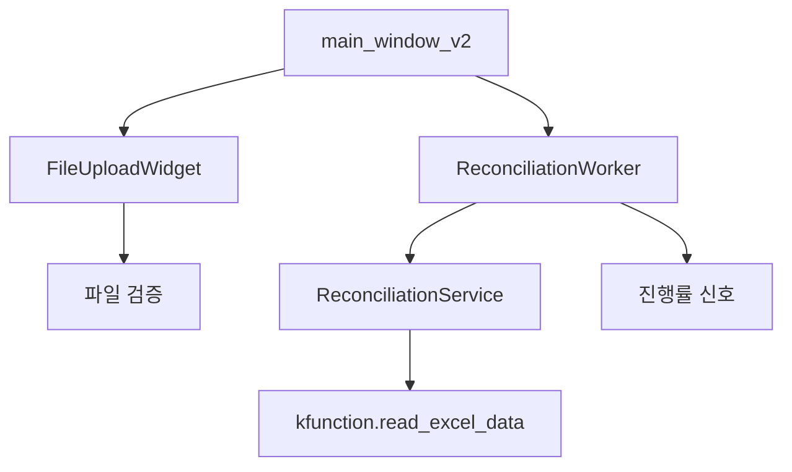

# 🎨 태스크 설계서

## 📋 기본 정보
- **프로젝트**: subcon
- **플랜**: 매입대사 시스템 UI 제품화
- **태스크 번호**: 03
- **태스크 ID**: f593c242-e5d1-4525-aea7-44278c8d6c3a
- **태스크명**: 파일 업로드 모듈 개발
- **작성일**: 2025-07-14
- **작성자**: AI Assistant
- **문서 경로**: C:\Users\Administrator\Desktop\subcon\docs\design\purchase_reconciliation_ui_task03_file_upload_module_design_20250714.md

## 🎯 설계 목적
### 요구사항
1. ReconciliationService 초기화 오류 수정
2. 지불보조장 파일 필수 검증 추가
3. 백그라운드 멀티스레드 처리 구현
4. 대사 로직을 노트북과 동일하게 구현
5. 진행률 표시 및 완료 알림 기능

### AI의 이해
현재 시스템에는 여러 문제가 있습니다:
- ReconciliationService가 잘못된 인자를 받고 있음
- 필수 파일 검증이 제대로 작동하지 않음
- UI가 블로킹되어 응답성이 떨어짐
- 대사 로직이 노트북과 다르게 구현됨

### 해결하려는 문제
1. **즉각적 오류**: ReconciliationService 초기화 오류
2. **필수 파일 검증**: 지불보조장이 없으면 실행 불가
3. **응답성**: 백그라운드 처리로 UI 블로킹 방지
4. **정확성**: 노트북과 동일한 대사 로직 구현

## 🔍 현재 시스템 분석
### 관련 모듈
- src/ui/main_window_v2.py (ReconciliationService 호출 수정)
- src/services/reconciliation_service_v2.py (로직 개선)
- src/ui/widgets/file_upload_widget.py (새로 생성)
- src/ui/workers/reconciliation_worker.py (새로 생성)

### 의존성 맵

## 💡 구현 방향
### 접근 방법
1. **오류 수정**: ReconciliationService 초기화 수정
2. **파일 검증**: 필수 파일 체크 로직 강화
3. **백그라운드 처리**: QThread 기반 Worker 구현
4. **대사 로직**: 노트북 코드 정확히 이식

### 주요 변경사항
1. **ReconciliationService 초기화 수정**
   - 잘못된 코드: reconciliation_service = ReconciliationService(excel_service)
   - 올바른 코드: reconciliation_service = ReconciliationService()

2. **필수 파일 검증 추가**
   - 협력사단품별매입, 기준, 매입세금계산서, 지불보조장(필수!), 매입세금계산서(WIS)
   - 지불보조장이 없으면 실행 불가

3. **ReconciliationWorker 클래스**
   - QThread 상속
   - progress, message, finished, error 시그널

4. **대사 로직 개선**
   - 노트북의 복잡한 대사 로직 완전 이식
   - 금액대사, 순차대사, 부분대사 구현

### 코드 구조
ReconciliationWorker 클래스:
- __init__: 파일 경로, 시작/종료 날짜
- run: 백그라운드 실행
  1. 서비스 초기화
  2. 데이터 로드 (20% 진행률)
  3. 대사 처리 (100% 진행률)
  4. 완료 신호 발생

## ⚠️ 영향도 분석
### 직접 영향
- **변경 파일**: 
  - main_window_v2.py (ReconciliationService 호출 수정)
  - reconciliation_service_v2.py (대사 로직 개선)
- **새 파일**: 
  - src/ui/workers/reconciliation_worker.py
  - src/ui/widgets/progress_dialog.py
- **삭제 파일**: 없음

### 간접 영향
- **성능**: 백그라운드 처리로 UI 응답성 향상
- **사용성**: 진행률 표시로 사용자 경험 개선
- **안정성**: 필수 파일 검증으로 오류 방지

### 하위 호환성
- 기존 파일 형식 그대로 지원
- API 변경 없음

## 🛡️ 리스크 관리
| 리스크 | 가능성 | 영향도 | 대응 방안 |
|--------|--------|--------|-----------|
| 스레드 충돌 | 낮음 | 높음 | 적절한 동기화 |
| 대용량 파일 처리 | 중간 | 중간 | 청크 단위 처리 |
| 메모리 부족 | 낮음 | 높음 | 가비지 컬렉션 |

## 📊 예상 결과
### 성공 기준
- [ ] ReconciliationService 오류 해결
- [ ] 지불보조장 필수 검증 작동
- [ ] 백그라운드 처리로 UI 응답성 유지
- [ ] 대사 로직이 노트북과 100% 일치
- [ ] 진행률 표시 및 완료 알림

### 예상 소요 시간
- 구현: 2시간
- 테스트: 1시간
- 문서화: 30분

## ✅ 검증 계획
### 단위 테스트
- 필수 파일 검증 테스트
- Worker 백그라운드 처리 테스트

### 통합 테스트
1. 6개 파일 모두 업로드
2. 지불보조장 없이 실행 시도 → 오류 확인
3. 모든 파일로 실행 → 진행률 확인
4. 결과 Excel 파일 생성 확인

## 📚 참고 자료
- 매입대사2.ipynb 원본 파일
- PyQt6 QThread 문서
- 기존 ReconciliationService 구현
