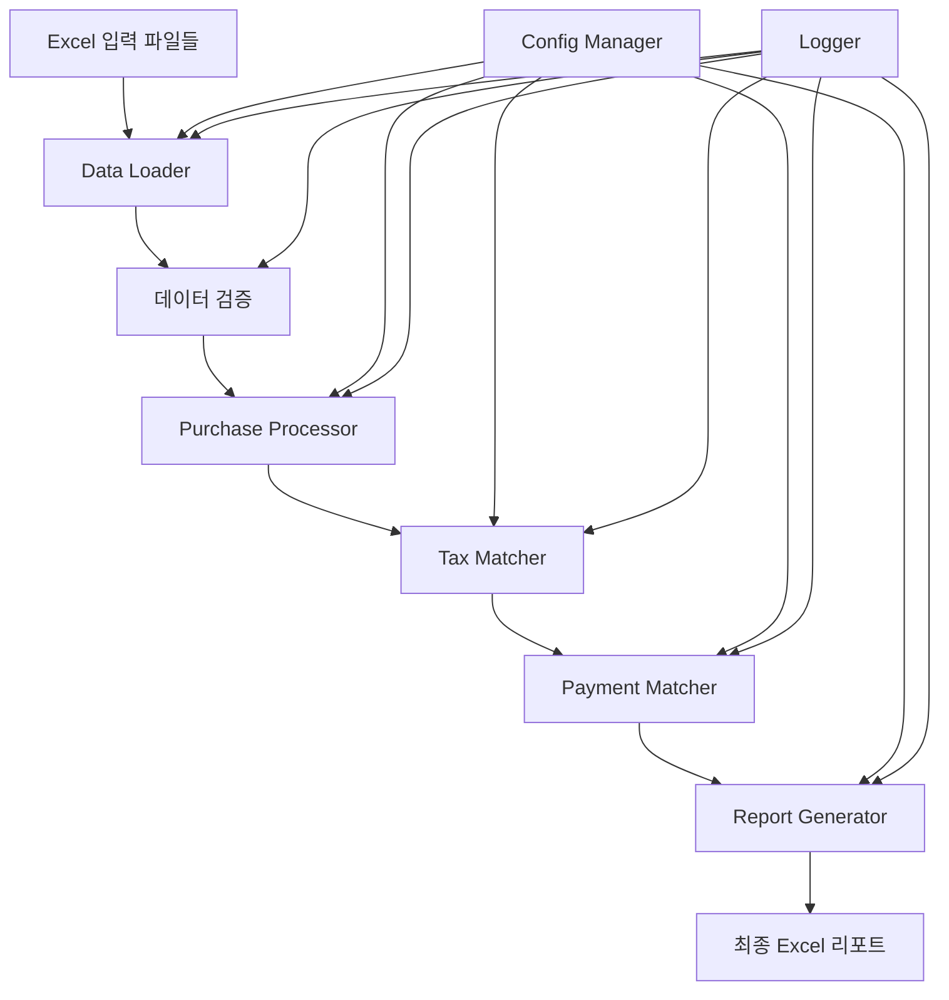

# 매입대사 시스템 설계 문서

## 1. 시스템 개요

### 1.1 목적
매입대사 시스템은 협력사별 매입 데이터와 세금계산서, 지불보조장을 자동으로 대사하여 정확한 지불 예정 금액을 산출하고 이상 내역을 감지하는 시스템입니다.

### 1.2 주요 기능
- 협력사별 매입 데이터 집계 및 분석
- 세금계산서와 매입 데이터의 자동 매칭
- 지불보조장과의 대사를 통한 실제 지불 내역 검증
- 지불 기간별 분류 및 이상 내역 감지
- 최종 대사 결과 리포트 생성

## 2. 시스템 아키텍처

### 2.1 모듈 구조
```
subcon/
├── src/
│   ├── __init__.py
│   ├── data_loader/          # 데이터 로딩 모듈
│   │   ├── __init__.py
│   │   ├── excel_reader.py   # Excel 파일 읽기
│   │   └── validators.py     # 데이터 검증
│   ├── processors/           # 데이터 처리 모듈
│   │   ├── __init__.py
│   │   ├── purchase_processor.py  # 매입 데이터 처리
│   │   ├── tax_matcher.py        # 세금계산서 매칭
│   │   └── payment_matcher.py    # 지불보조장 매칭
│   ├── reports/              # 리포트 생성 모듈
│   │   ├── __init__.py
│   │   └── excel_reporter.py # Excel 리포트 생성
│   ├── utils/                # 유틸리티
│   │   ├── __init__.py
│   │   ├── logger.py         # 로깅
│   │   └── config.py         # 설정 관리
│   └── main.py              # 메인 실행 파일
├── tests/                    # 테스트 코드
├── config/
│   └── config.yaml          # 설정 파일
└── logs/                    # 로그 파일
```

### 2.2 데이터 흐름도


## 3. 데이터 모델

### 3.1 입력 데이터 스키마

#### 협력사단품별매입
| 컬럼명 | 타입 | 설명 |
|--------|------|------|
| 년월 | Float | YYYYMM 형식 |
| 협력사코드 | Float | 협력사 고유 코드 |
| 협력사명 | String | 협력사 이름 |
| 단품코드 | Float | 상품 코드 |
| 단품명 | String | 상품명 |
| 면과세구분명 | String | 과세/면세 구분 |
| 최종매입금액 | Float | 매입 금액 |

#### 세금계산서(WIS)
| 컬럼명 | 타입 | 설명 |
|--------|------|------|
| 협력사코드 | String | 협력사 코드 |
| 계산서작성일 | Date | 세금계산서 작성일 |
| 계산서구분 | String | 일반세금계산서/일반계산서 |
| 사업자번호 | String | 사업자등록번호 |
| 공급가액 | Float | 공급가액 |
| 세액 | Float | 부가세액 |
| 국세청승인번호 | String | 승인번호 |

### 3.2 처리 데이터 스키마

#### 대사 결과
| 컬럼명 | 타입 | 설명 |
|--------|------|------|
| key | String | 년월+협력사코드+면과세구분 |
| 구분키 | String | 대사 유형 (금액대사/순차대사/부분대사) |
| 차이내역 | Float | 매입금액과 실제 지불금액 차이 |
| 비고 | String | 확인필요/이전기간지급/이후기간지급 |

## 4. 핵심 알고리즘

### 4.1 세금계산서 매칭 알고리즘

#### 4.1.1 금액대사 (1:1 매칭)
```python
def match_exact_amount(purchase_amount, tax_invoices):
    """정확히 일치하는 금액 찾기"""
    for invoice in tax_invoices:
        if abs(invoice['공급가액'] - purchase_amount) < TOLERANCE:
            return invoice
    return None
```

#### 4.1.2 순차대사 (1:N 매칭)
```python
def match_sequential(purchase_amount, tax_invoices):
    """여러 건의 합이 매입금액과 일치하는 경우"""
    # FIFO 방식으로 날짜순 정렬
    sorted_invoices = sorted(tax_invoices, key=lambda x: x['작성일'])
    
    cumulative_sum = 0
    selected = []
    
    for invoice in sorted_invoices:
        cumulative_sum += invoice['공급가액']
        selected.append(invoice)
        
        if abs(cumulative_sum - purchase_amount) < TOLERANCE:
            return selected
        elif cumulative_sum > purchase_amount:
            break
    
    return None
```

#### 4.1.3 부분대사
```python
def match_partial(purchase_amount, tax_invoices):
    """세금계산서 금액이 매입금액보다 큰 경우"""
    candidates = [inv for inv in tax_invoices 
                  if inv['공급가액'] > purchase_amount]
    
    if candidates:
        # 차이가 최소인 항목 선택
        return min(candidates, 
                   key=lambda x: x['공급가액'] - purchase_amount)
    return None
```

### 4.2 지불 기간 분류 알고리즘
```python
def classify_payment_period(issue_date, payment_date):
    """국세청발급일과 회계일 간의 일수로 분류"""
    days = (payment_date - issue_date).days
    
    if days <= 10:
        return "10일이하"
    elif days <= 15:
        return "10초과_15일이하"
    elif days <= 30:
        return "15초과_30일이하"
    else:
        return "30일초과"
```

## 5. 에러 처리 및 로깅

### 5.1 에러 유형
- **FileNotFoundError**: 입력 파일 없음
- **ValidationError**: 데이터 검증 실패
- **MatchingError**: 대사 실패
- **ReportGenerationError**: 리포트 생성 실패

### 5.2 로깅 레벨
- **INFO**: 정상 처리 진행 상황
- **WARNING**: 대사 불일치, 확인 필요 항목
- **ERROR**: 처리 실패, 예외 발생

## 6. 설정 관리

### 6.1 config.yaml 구조
```yaml
# 파일 경로 설정
input_files:
  purchase_data: "data/협력사단품별매입(최종작업용).xlsx"
  standard_data: "data/기준(최종작업용).xlsx"
  tax_invoice_wis: "data/매입세금계산서(WIS).xlsx"
  tax_invoice_detail: "data/매입세금계산서.xlsx"
  payment_book: "data/지불보조장.xlsx"

# 출력 설정
output:
  directory: "output/"
  filename_pattern: "최종파일_{date}.xlsx"

# 처리 옵션
processing:
  tolerance: 0.000001  # 금액 비교 허용 오차
  payment_period_start: "2024-01-01"
  payment_period_end: "2024-06-30"

# 로깅 설정
logging:
  level: "INFO"
  file: "logs/reconciliation.log"
```

## 7. 성능 최적화

### 7.1 데이터 처리 최적화
- pandas의 벡터화 연산 활용
- 대용량 파일의 경우 청크 단위 처리
- 불필요한 데이터 복사 최소화

### 7.2 메모리 관리
- 처리 완료된 DataFrame 즉시 삭제
- garbage collection 명시적 호출
- COM 객체 사용 후 확실한 해제

## 8. 테스트 전략

### 8.1 단위 테스트
- 각 매칭 알고리즘별 테스트
- 데이터 검증 로직 테스트
- 날짜 계산 로직 테스트

### 8.2 통합 테스트
- 전체 파이프라인 테스트
- 엣지 케이스 처리 테스트
- 대용량 데이터 처리 테스트

## 9. 향후 개선 사항

### 9.1 기능 개선
- 웹 인터페이스 추가
- 실시간 대사 진행 상황 표시
- 대사 결과 대시보드

### 9.2 성능 개선
- 병렬 처리 도입
- 데이터베이스 연동
- 캐싱 메커니즘 구현
